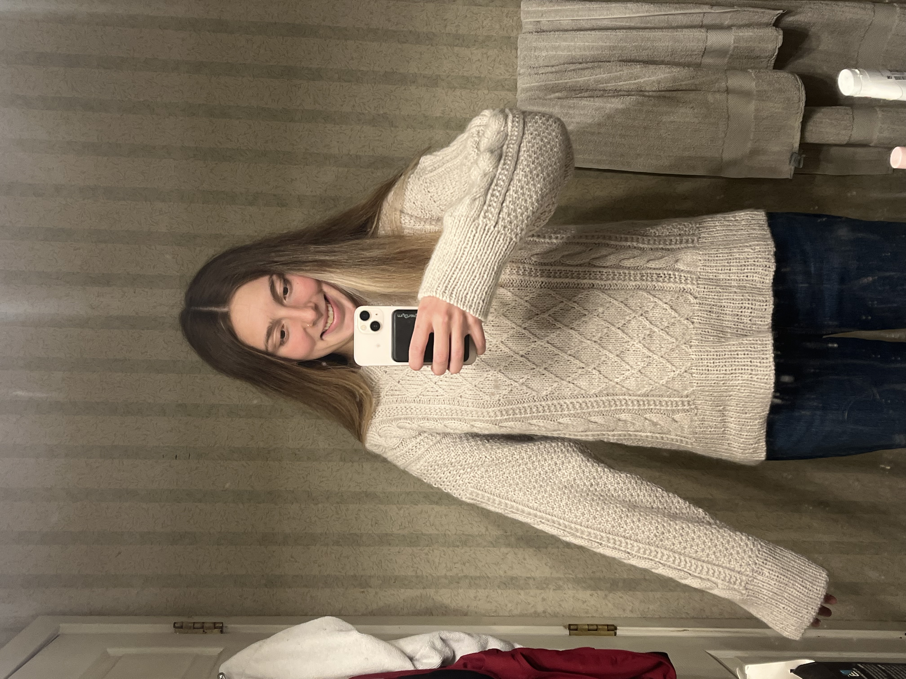

## About Me

Hi! I’m Clara, a first-year Master’s student in Health Data Science at the University of Michigan.

---

## Knitting

In my free time, I love knitting—it's one of my favorite ways to relax and unwind.

{fig-alt="My proudest completed knit object: the Moby Sweater (January 2026)" width="400"}

---

## Travel

I also love being outdoors—especially hiking, trying new foods, and traveling (even better when I can do all three at once!).

{fig-alt="Volcano hiking on my trip to Nicaragua" width="400"}

---

## Running

I’m an avid runner and currently “training” for my fourth marathon, coming up in early May in Prague.  

Right now, I’m dealing with an injury, so running is on pause—but I’m hoping to be back soon.

My most recent marathon was in Ann Arbor—check out my results [here](https://my.raceresult.com/365741/).